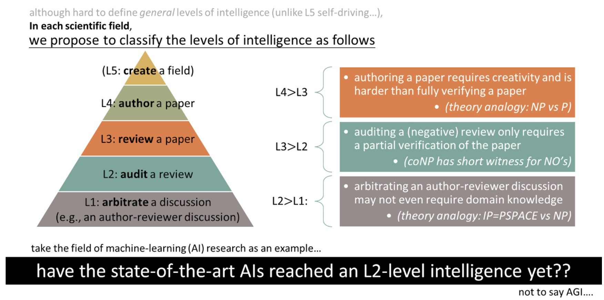

# OpenReview Agents

This repository provides a collection of agents that work with OpenReview: automated meta-review generation, batch evaluation, export helpers, and utilities to streamline the review workflow.

## Installation

### Requirements
```
conda create -n or_bot python=3.12
conda activate or_bot
pip install -r requirements.txt
```

### API Keys
- **OpenAI API**
    - Set an environment variable:
        ```
        export OPENAI_API_KEY="Your Key"
        ```
    - Alternatively adjust the credentials directly inside `OpenAIClient` in `meta_review_pipeline/utils/api_client.py`.
- **Azure OpenAI**
    - Authenticate with Azure CLI:
        ```
        az login
        ```
    - Update the deployment and endpoint settings in `AzureOpenAIClient` within the same module.
    - Add `--api azure` 

## Meta-review Generation

Use the batch pipeline to download submissions and create meta-reviews in one pass.

- **Area Chairs**
    ```
    python -m meta_review_pipeline.batch_meta_review \
            ICLR.cc/2026/Conference \
            --role ac
    ```
    The default output repository is `./outputs/generated_meta_reviews/`
  
    If use azure api
    ```
    python -m meta_review_pipeline.batch_meta_review \
            ICLR.cc/2026/Conference \
            --role ac \
            --api azure
    ```
- **Authors**
    ```
    python -m meta_review_pipeline.batch_meta_review \
            ICLR.cc/2026/Conference \
            --role author 
    ```
    Add `--no-rebuttal` if the rebuttal phase has not yet occurred.
- **Audience / Spectators**
    ```
    python -m meta_review_pipeline.batch_meta_review \
            ICLR.cc/2026/Conference \
            --role audience \
            --forum-id VaS6xcDrTb, tcsZt9ZNKD 
    ```
- **Generate from an exiting folder**
    ```
    python -m meta_review_pipeline.batch_meta_review \
            ICLR.cc/2026/Conference \
            --submission-folder outputs/xxxxxx 
    ```


Key flags to be aware of:
- `venue_id` – positional argument selecting the conference (e.g., `ICML.cc/2025/Conference`, `NeurIPS.cc/2026/Conference`).
- `--role {author,reviewer,ac,sac,audience}` – chooses which assignment list to pull (default: `ac`).
- `--audience-paper-type {oral,spotlight,poster,rejected}` – optional acceptance filter for audience mode (defaults to `poster` when no forum IDs are supplied).
- `--forum-id FORUM_ID` – limit downloads to specific forum IDs; repeat or provide a comma-separated list for multiple papers.
- `--limit N` – process only the first `N` assignments when testing.
- `--skip-existing-export` – reuse local exports instead of downloading again.
- `--submission-folder PATH` – reuse an existing exported bundle without hitting the API.

## Meta-review Evaluation

Senior Area Chairs (or anyone auditing meta-reviews) can evaluate generated files in bulk:
```
python -m meta_review_pipeline.batch_meta_review \
        NeurIPS.cc/2025/Conference \
        --role sac \
        --task evaluate \
```
You can switch `--role` to other perspectives (e.g., `author`) to mirror different assignment views.

## Other Functions

### Export OpenReview Profiles
Export assignment bundles without generating meta-reviews:
```
python -m crawler_pipeline.export_assigned_submissions \
        ICLR.cc/2026/Conference \
        --role ac \
        --download-dir outputs/openreview_exports \
        --skip-existing-export
```

## Review and Rebuttal

Support for review drafting and rebuttal assistance is under active development. They require higher level intelligence following the [DOGE protocol](https://doge.allen-zhu.com/) proposed by Zeyuan Allen-Zhu.



## Layout

```
openreview_agents/
├── README.md                              # Project overview and usage guide
├── requirements.txt                       # Python dependencies for the agents
├── DOGE.jpg                               # Mascot nod to the DOGE protocol
├── crawler_pipeline/                      # OpenReview export utilities
│   ├── __init__.py
│   ├── assignment_fetch.py                # Role-aware assignment helpers (author/reviewer/audience)
│   ├── export_assigned_submissions.py     # Export-only CLI and helpers
│   └── forum_exporter.py                  # Forum-to-text conversion utilities
├── meta_review_pipeline/                  # Meta-review generation and evaluation flows
│   ├── __init__.py
│   ├── batch_meta_review.py               # Batch export + meta-review driver
│   ├── generation/
│   │   ├── __init__.py
│   │   └── generate_meta_review.py        # Meta-review generation CLI + helpers
│   ├── utils/
│   │   ├── __init__.py
│   │   ├── api_client.py                  # Azure/OpenAI client wrappers
│   │   └── export_process.py              # PDF and review extraction helpers
│   └── evaluate/
│       ├── __init__.py
│       ├── batch_evaluate_meta_review.py  # Batch evaluation CLI
│       └── evaluate_meta_review.py        # Single meta-review evaluator
└── outputs/                               # Saved exports, generated reviews, evaluations
```


